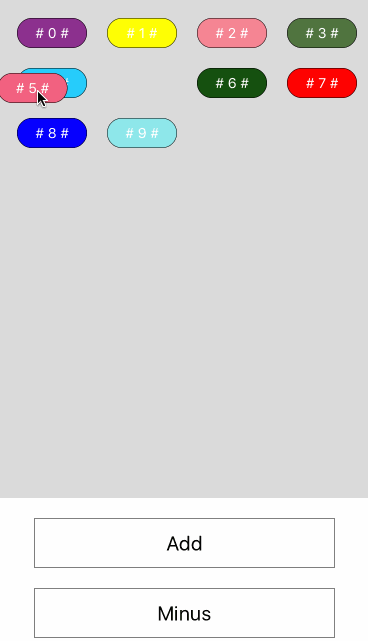

# PortibleView

this is a Component that can change the order of children component in itself.


## Demo



## Installation

`npm install react-native-portableView -save`

## Documentaion

### Usage
```javascript	
import PortableView from 'react-native-portable-view';
	
class Demo extends Component {
	render() {
    	return (
        <PortableView/>
    	)	
      }
 }
 
```
### Examples
```
<PortableView
          style={{flex:1,width:375,flexWrap:'wrap',alignItems:'center',flexDirection:'row',backgroundColor:'#dbdbdb',height:500,marginTop:20}}
          data={SECTIONS}
          renderContent={this.renderContent.bind(this)}
          positionHasBeenChanged={(position1,position2) => {}}
          setPanResponderHandler={(obj,position,index) => {}}
        />
```
## Props

- `renderContent`(Function) render the content view
- `positionHasBeenChanged`(Function(oldPosition,newPosition)) callback when order change
- `setPanResponderHandler`(Function(obj,position,index)) callback when content become the panresponderhandler

